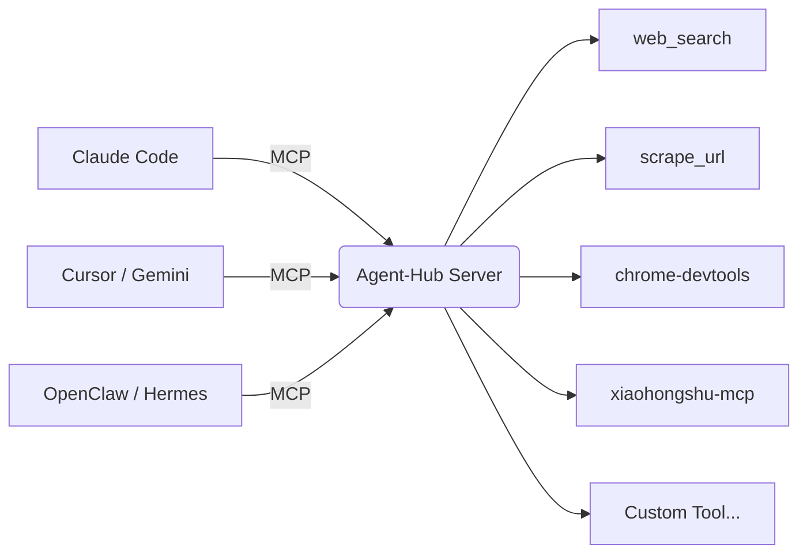

<div align="center">

# Agent-Hub

**AI 原生的工具共享层 — 一个 MCP，所有 Agent 共享**

[English](README_EN.md) | 中文

[](https://opensource.org/licenses/MIT)
[](https://modelcontextprotocol.io)

</div>

---

## 这是什么

两层角色：

1. **MCP Server** - 为 AI Agent 提供统一的工具接口，暴露搜索、抓取、社媒、浏览器控制等能力
2. **工具管理器** - 用 `ah` 命令管理本地所有工具（扫描、更新、卸载）

支持 Claude、Gemini、Cursor、Codex、OpenClaw、Hermes 等所有主流 Agent。

---

## 架构



所有 Agent 连接同一个 MCP Server，共享同一套工具。

---

## 核心价值

### AI 原生：工具告诉 AI 怎么用自己

每个工具都有 `ai_hints`，让 AI 精准选择：

```json
{
  "ai_hints": {
    "when_to_use": "用户需要获取最新网页信息",
    "examples": [{"query": "AI Agent 最新进展"}],
    "avoid": "不要用于已知的静态页面，直接用 scrape_url",
    "alternatives": "如果已知具体 URL，用 scrape_url 更快"
  }
}
```

工具不只是"能用"，而是主动告诉 AI 何时用、何时不用、有什么替代方案。

AI 自己选择工具，不需要路由器、不需要向量检索。

### 统一管理：人类知道本地有什么

```bash
ah scan           # 扫描本地所有工具（包括各 Agent 安装的）
ah list           # 查看工具列表和分布
ah update         # 检测哪些工具需要更新
ah update -i      # 一键更新所有工具
ah remove <name>  # 卸载工具
```

**解决问题**：
- 本地装了多少工具？分布在哪些 Agent？
- 哪些工具有更新？
- 如何统一卸载？

一处更新，所有 Agent 生效。

### 声明式定义：封装自己的工具

想封装自己的 CLI 工具？在 `skills/<your-tool>/SCHEMA.json` 写一个配置文件：

```
skills/
  my-search/
    SCHEMA.json    ← 工具定义
    bin/
      search       ← 你的脚本
```

MCP Server 自动发现、自动暴露。

---

## 内置工具

覆盖搜索、社媒、浏览器、开发等场景：

| 功能域 | 工具 |
|--------|------|
| 搜索与抓取 | web_search, scrape_url, stealth_get |
| 浏览器控制 | chrome-devtools, bb-browser |
| 社交媒体 | xiaohongshu-mcp, x-article, xreach |
| 开发工具 | gh, deep-researcher, mcp-server |
| 研究与情报 | nvidia-scout, cross-verify |
| 记忆与通知 | memory, notify |

详见 [完整工具清单](docs/skills.md)

---

## 快速开始

### 前置要求

- Python 3.10+
- pip

### 1. 安装

```bash
git clone https://github.com/tong20242100/agent-hub.git
cd agent-hub
pip install -e .
```

### 2. 启动 MCP Server

```bash
python3 bin/mcp_server.py
```

或使用命令：

```bash
ah server
```

### 3. 配置 Agent

**方法 1：让 Agent 自己配置（推荐）**

把下面这段发给你的 Agent：

```
请帮我配置 Agent-Hub MCP 服务器。项目路径是 /path/to/agent-hub。

你需要：
1. 确定你是哪个 Agent
2. 找到你的配置文件路径
3. 添加 MCP 服务器配置
4. 重启自己

配置完成后，验证：帮我搜索 "MCP protocol"
```

**方法 2：手动配置**

编辑 Agent 配置文件，添加：

```json
{
  "mcpServers": {
    "agent-hub": {
      "command": "python3",
      "args": ["/path/to/agent-hub/bin/mcp_server.py"]
    }
  }
}
```

### 4. 验证

```
帮我搜索 "MCP protocol latest news"
```

---

## 配置参考

详见 [配置文档](docs/configuration.md)，包含所有 Agent 的完整配置示例。

---

## License

MIT
