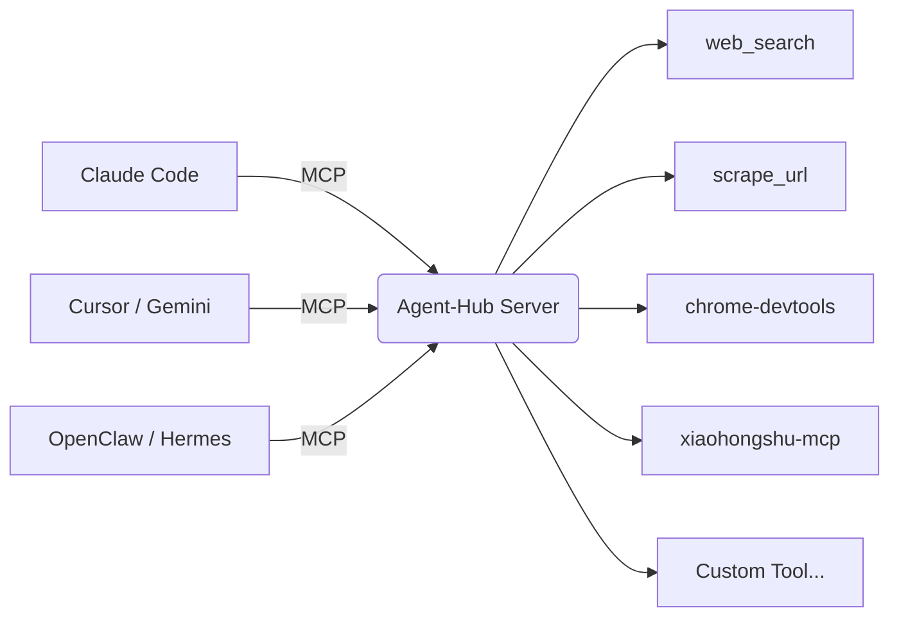

<div align="center">

# Agent-Hub

**AI-Native Tool Sharing Layer — One MCP, All Agents Share**

English | [中文](README.md)

[](https://opensource.org/licenses/MIT)
[](https://modelcontextprotocol.io)

</div>

---

## What is this

Two roles:

1. **MCP Server** - Provides unified tool interface for AI Agents, exposing search, scraping, social media, browser control and more
2. **Tool Manager** - Manage all local tools with `ah` command (scan, update, remove)

Supports Claude, Gemini, Cursor, Codex, OpenClaw, Hermes and all mainstream Agents.

---

## Architecture



All Agents connect to the same MCP Server, sharing the same tools.

### Modular Design

```
bin/
├── ah.py              # CLI entry
└── core/              # Core logic
    ├── auditor.py     # Compliance audit
    ├── discovery.py   # Cross-platform discovery
    └── manager.py     # Skill management
```

---

## Core Values

### AI-Native: Tools Tell AI How to Use Them

Every tool has `ai_hints` for precise AI selection:

```json
{
  "ai_hints": {
    "self_check": [
      "Do you have native search capability? Yes → Use your own first",
      "Need JSON structured output? Yes → Use this tool"
    ],
    "when_to_use": "When you don't have native search, or need Tavily structured output",
    "examples": [{"query": "AI Agent latest progress"}],
    "avoid": "Don't use if you have native capability; use scrape_url for known URLs"
  }
}
```

`self_check` forces AI to **self-verify** before calling tools, avoiding abuse of external tools.

AI selects tools by itself. No router, no vector retrieval needed.

### Unified Management: Humans Know What's Local

```bash
ah scan           # Scan all local tools (including those installed by other Agents)
ah list           # View tool list and distribution
ah status [name]  # View skill distribution status
ah update         # Check which tools need updates
ah update -i      # One-click update all tools
ah check --fix    # Compliance audit (check SCHEMA format, tone, etc.)
ah discover       # Global discovery of other Agent skills
ah remove <name>  # Remove tool
```

**Solves**:
- How many tools installed locally? Which Agents have them?
- Which tools have updates?
- How to uninstall uniformly?

Update once, all Agents affected.

### Declarative Definition: Wrap Your Own Tools

Want to wrap your CLI tool? Write a config file at `skills/<your-tool>/SCHEMA.json`:

```
skills/
  my-search/
    SCHEMA.json    ← Tool definition
    bin/
      search       ← Your script
```

MCP Server auto-discovers, auto-exposes.

---

## Built-in Tools

Covers search, social media, browser, development and more:

| Domain | Tools |
|--------|-------|
| Search & Scraping | web_search, scrape_url, stealth_get, lightpanda |
| Browser Control | chrome-devtools, bb-browser |
| Social Media | xiaohongshu-mcp, x-article, xreach |
| Development | gh, deep-researcher, mcp-server |
| Research & Intel | nvidia, cross-verify |
| Memory & Notify | memory, notify |

See [Full Tool List](docs/skills.md)

---

## Quick Start

### Requirements

- Python 3.10+
- pip

### 1. Install

```bash
git clone https://github.com/tong20242100/agent-hub.git
cd agent-hub
pip install -e .
```

### 2. Start MCP Server

```bash
python3 bin/mcp_server.py
```

Or use command:

```bash
ah server
```

### 3. Configure Agent

**Method 1: Let Agent configure itself (Recommended)**

Send this to your Agent:

```
Please help me configure Agent-Hub MCP server. Project path is /path/to/agent-hub.

You need to:
1. Determine which Agent you are
2. Find your config file path
3. Add MCP server configuration
4. Restart yourself

After configuration, verify: help me search "MCP protocol"
```

**Method 2: Manual configuration**

Edit Agent config file, add:

```json
{
  "mcpServers": {
    "agent-hub": {
      "command": "python3",
      "args": ["/path/to/agent-hub/bin/mcp_server.py"]
    }
  }
}
```

### 4. Verify

```
Help me search "MCP protocol latest news"
```

---

## Configuration Reference

See [Configuration Docs](docs/configuration.md) for complete configuration examples of all Agents.

---

## License

MIT